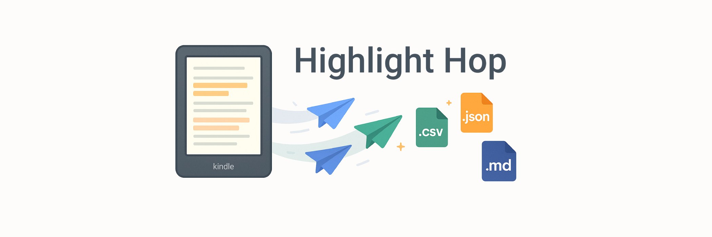
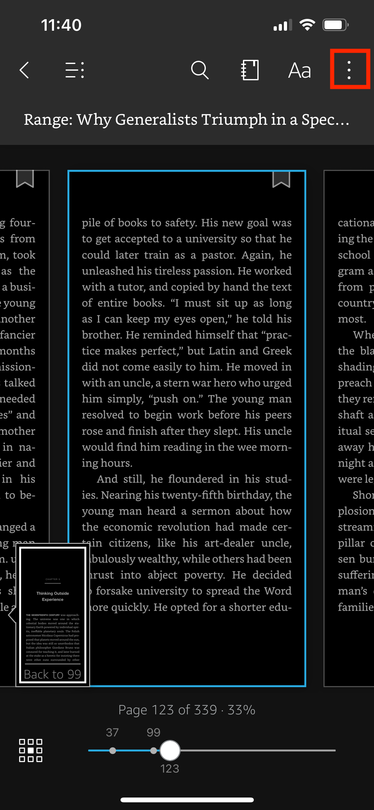
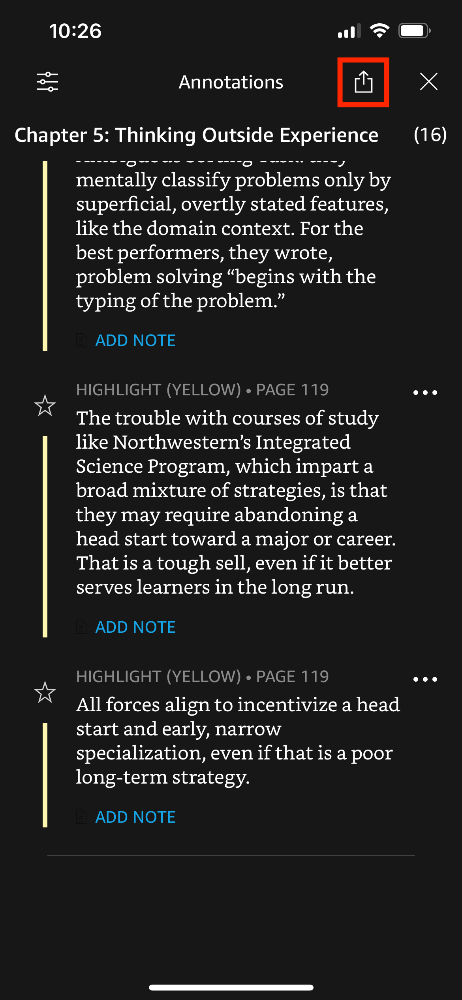
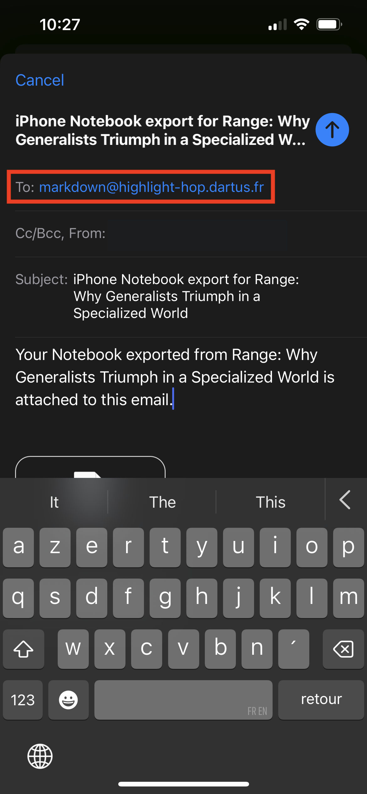
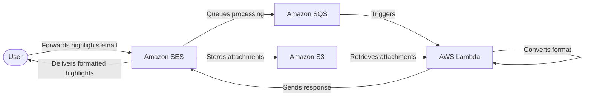

# Highlight Hop

> Own your Kindle highlights one email at a time.

Convert your Kindle highlights and notes to Markdown, CSV, or JSON in seconds:

- ✅ No vendor lock-in — own your reading data forever.
- ✅ No browser extensions required.
- ✅ No need to connect your Kindle to your computer.

Highlight Hop is an email bot to quickly extract your Kindle highlights. Simply forward your book annotations from the Kindle iOS or Android application to one of these email addresses to recieve your highlights and notes in the desired format:

- For Markdown: [markdown@highlight-hop.dartus.fr](mailto:markdown@highlight-hop.dartus.fr)
- For CSV: [csv@highlight-hop.dartus.fr](mailto:csv@highlight-hop.dartus.fr)
- For JSON: [json@highlight-hop.dartus.fr](mailto:json@highlight-hop.dartus.fr)

## iOS Walkthrough

<table>
  <tr>
    <td style="width:33%"><strong>Step 1:</strong> Open the book, tap the center of the screen and then on the Menu icon</td>
    <td style="width:33%"><strong>Step 2:</strong> Navigate to Annotations</td>
    <td style="width:33%"><strong>Step 3:</strong> Tap on the Share icon</td>
  </tr>
  <tr>
    <td></td>
    <td></td>
    <td></td>
  </tr>
  <tr>
    <td><strong>Step 4:</strong> Tap on Export</td>
    <td><strong>Step 5:</strong> Enter one of the email addresses listed above and press Send.</td>
  </tr>
  <tr>
    <td></td>
    <td></td>
    <td></td>
  </tr>
</table>

## How it works

Highlight Hop uses a serverless architecture deployed on AWS with the following components:

- _Amazon SES_ - Receives emails and sends responses
- _Amazon S3_ - Stores raw email attachments temporarily
- _Amazon SQS_ - Queues email processing tasks
- _AWS Lambda(Node.js)_ - Processes highlights and generates output files.

Detailed requirements for the project can be found in the [product brief](./docs/product_brief.md)
